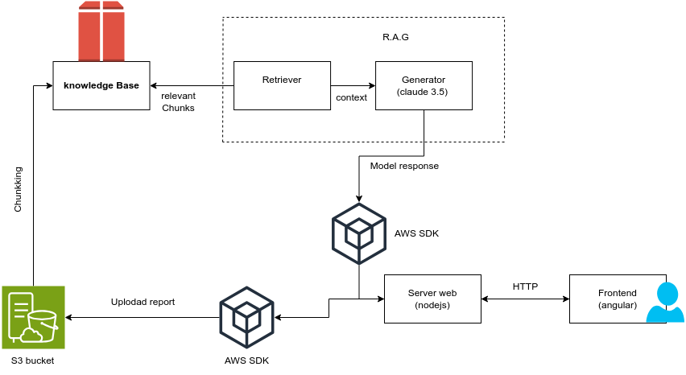

# Geppetto: AI Financial Analysis Dashboard


## Table of Contents
1. [Project Overview](#project-overview)
2. [Polyfinance's 2024 Datathon](#polyfinances-2024-datathon)
3. [Setup and Launch](#setup-and-launch)
   - [Prerequisites](#prerequisites)
   - [Setup Instructions](#setup-instructions)
4. [Features](#features)
   - [Automatic Report Summarization](#automatic-report-summarization)
   - [Sentiment Analysis](#sentiment-analysis)
   - [Financial Indicator Monitoring](#financial-indicator-monitoring)
   - [Financial Trend Predictions](#financial-trend-predictions)
   - [KPI Extraction and Visualization](#kpi-extraction-and-visualization)
   - [Multi-Report Comparisons](#multi-report-comparisons)
5. [User Interface](#user-interface)
6. [Tech Stack](#tech-stack)
7. [Architecture](#architecture)
8. [Usage](#usage)
9. [Functionality](#functionality)
10. [Contributors](#contributors)
11. [License](#license)

## Project Overview
Geppetto is an advanced AI-driven application designed to empower financial analysts by automating key tasks, making the analysis of financial reports faster and more insightful. Developed as part of the 2024 Polyfinance Datathon, Geppetto leverages generative AI and the AWS ecosystem to provide cutting-edge tools like automatic summarization, sentiment analysis, and real-time financial monitoring. This tool offers seamless integration with AWS services, enabling analysts to extract KPIs, visualize data, and perform comprehensive trend predictions with just a few clicks.

## Polyfinance's 2024 Datathon
The Polyfinance 2024 Datathon is a high-impact 48-hour challenge, sponsored by National Bank of Canada, focusing on innovation in financial analytics. Participants were tasked with developing a generative AI-powered tool to assist financial analysts in synthesizing and interpreting data more efficiently. Armed with AWS resources like Bedrock, Cloud9, and a wealth of financial data, the Geppetto team created a robust solution to provide real-time insights, facilitate informed decision-making, and increase the accessibility of complex financial analyses.

## Setup and Launch

### Prerequisites
To run this project, you will need:
- Python installed on your machine.
- Node.js and npm installed on your machine.


### Setup Instructions

1. **Clone the Repository**:
   ```bash
   git clone https://github.com/o-benz/Geppetto.git
   cd geppetto
   ```

2. **Run the Automated Setup Script**:
   - Simply run the provided setup script to automate the setup and launch process:
     ```bash
     python setup.py
     ```
   - This script will handle dependencies, credentials, and initial setup. If it encounters any issues, continue with the manual steps below.

3. **Manual Setup (if the script fails)**:
   - **AWS Credentials Setup**: Copy the `credentials` file from the repository root to `C:\Users\user\.aws\` (replace `user` with your Windows username).
   - **Install Required Python Packages**:
     ```bash
     pip install -r requirements.txt
     ```

4. **Angular Client Setup**:
   ```bash
   cd client
   npm ci
   ```

5. **NodeJS Server Setup**:
   ```bash
   cd server
   npm ci
   ```


### Starting the Website Locally
1. **Start the Angular Client**:
   ```bash
   cd client
   npm start
   ```
2. **Start the NodeJS Server in a separate terminal**:
   ```bash
   cd server
   node index.js
   ```
3. **Access the Angular application in your browser at** `http://localhost:4200`.

---

## Features
### Automatic Report Summarization
Geppetto uses generative AI to generate concise, accurate summaries of extensive financial reports. This feature quickly extracts essential insights, allowing analysts to gain an overview without reading through lengthy data.

### Sentiment Analysis
Geppetto’s sentiment analysis capability interprets sections of the report, such as executive comments, to detect tones like optimism or caution. This feature gives analysts a summary of company sentiment, helpful for understanding the broader mood conveyed in reports.

### Chatbot Assistance
Geppetto includes an AI-powered chatbot, enabling users to ask follow-up questions about the analyzed report. The chatbot uses advanced prompt engineering and a specialized retrieval-augmented generation (RAG) model to provide accurate, context-specific answers, making it easier for analysts to dive deeper into specific insights or clarify details on demand.

### KPI Extraction and Visualization
Geppetto extracts core KPIs and presents them through visually appealing, interactive charts. Users can export individual visuals as PNGs or download an entire report as a PDF or CSV.


## User Interface
Geppetto’s user-friendly, interactive interface makes navigating between various tools straightforward. The interface includes a:
- **Home Page**: "Start Analyzing" button leading to report upload.

- **Features Page**: Displays the uploaded report’s company info, logo, and basic details.

- **Summary & Sentiment Analysis Page + ChatBot**: Provides an AI-generated summary and sentiment overview.


- **Data Analysis Page**: Includes key KPIs, five interactive charts, and AI-generated insights.


Each feature is designed with accessibility in mind, making complex data easy to navigate and understand.

## Tech Stack
- **Frontend**: Angular (TypeScript), HTML, SCSS, and a responsive design framework for optimized user interaction.
- **Backend**: NodeJS, responsible for handling HTTP requests and serving as the link between the Angular client and AWS.
- **AWS Services**: Amazon Bedrock for generative AI, Amazon S3 for secure storage, and integrated API calls to process and retrieve data.
- **Backend Processing**: Python scripts communicate with the AWS API to load files into S3, synchronize data with our knowledge base, and perform prompt engineering to generate high-quality responses.

Our application is designed with advanced prompt engineering techniques to optimize responses and ensure analysts receive accurate, contextually relevant insights.

## Architecture
Geppetto’s architecture is modular and scalable, consisting of:
1. **Angular Frontend** that communicates via HTTP with:
2. **NodeJS Backend**, which interacts with Python scripts.
3. **AWS Integration**: Python scripts utilize AWS services, including Amazon S3 for storage and Bedrock for AI-powered processing. 



## Functionality
Geppetto provides a suite of functionalities:
- **Upload Financial Reports** and analyze them in real-time.
- **Generate Summaries and Sentiment Analysis** with generative AI.
- **Access a Finance ChatBot** for follow-up questions.
- **Display Financial Indicators and KPIs** through visually intuitive, exportable charts.

## Contributors
- **Omar Benzekri** - [o-benz](https://github.com/o-benz)
- **Tinihane Boudiab** - [tinhinaneboudiab](https://github.com/tinhinaneboudiab)
- **Younes Allouchi** - [youyoulebgdemeknes](https://github.com/youyoulebgdemeknes)
- **Souhil Zaida** - [The-Lite](https://github.com/The-Lite)

## License
This project is licensed under the MIT License. See the [LICENSE](LICENSE.txt) file for details.
